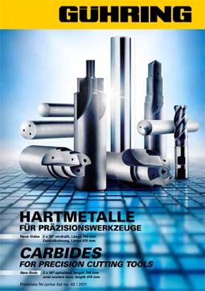

Характеристики режущего инструмента во&nbsp;многом зависят от&nbsp;материала, из&nbsp;которого он&nbsp;изготовлен. Многое зависит от&nbsp;соотношения карбида вольфрама и&nbsp;кобальта, от&nbsp;размера и&nbsp;равномерности зерна.

Наша компания является производителем осевого монолитного инструмента из&nbsp;твердого сплава, что позволяет судить о&nbsp;существующих альтернативах на&nbsp;этом рынке, соответствии цены и&nbsp;качества конкурирующих поставщиков. Основным вектором для нас является высокое качество и&nbsp;его постоянство, срок поставок, гибкость в&nbsp;номенклатуре заказа.

В&nbsp;ходе многочисленных испытаний различных марок, представленных в&nbsp;России, в&nbsp;том числе применяемо к&nbsp;разным группам обрабатываемых материалов и&nbsp;разным способам обработки, мы&nbsp;пришли к&nbsp;выводу, что заготовки из&nbsp;твердого сплава марки G&Uuml;HRING (Германия) наиболее полно удовлетворяют даже самые притязательные запросы наших заказчиков. В&nbsp;дальнейшем развитие сотрудничества привело к&nbsp;получению нами статуса официального дилера этой торговой марки.

Мы&nbsp;предлагаем Вам поставку заготовок из&nbsp;твердого сплава G&uuml;hring напрямую с&nbsp;нашего склада в&nbsp;городе Пенза.

При производстве наших изделий мы&nbsp;применяем марки DK460UF (универсального применения), DK255F и&nbsp;DK500UF.

  