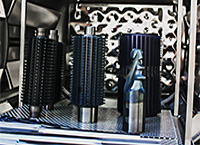

Мы&nbsp;предоставляем услуги по&nbsp;нанесению износостойких и&nbsp;защитных тонкопленочных покрытий с&nbsp;высокой адгезией на&nbsp;установке Platit Pi80.

Примеры изделий, на&nbsp;которые можно нанести наши покрытия:

- твердосплавные сверла, фрезы, развертки;
- метчики и быстрорежущий инструмент;
- зуборезный (долбяки, червячные фрезы);
- резьбонакатные ролики и прокатные валки;
- матрицы, пуансоны и вырубные штампы.

Наш опыт при производстве собственного твердосплавного инструмента и&nbsp;работе с&nbsp;изделиями заказчика показывает, что применение современных износостойких покрытий дает значительный эффект, а&nbsp;в&nbsp;ряде случаев является единственно возможным средством реализации технологического процесса с&nbsp;заданными параметрами по&nbsp;производительности и&nbsp;надежности. На&nbsp;сегодняшний день более&nbsp;90% твердосплавного инструмента и&nbsp;более&nbsp;70% быстрорежущего покрывается, а&nbsp;для ряда зуборезного этот показатель доходит до&nbsp;100%.

При этом предъявляются особые требования к&nbsp;изделиям: они должны быть в&nbsp;чистом виде, без следов смазки, окраски, скотча. Изделия должны находиться в&nbsp;упаковке, исключающей возможность повреждения продукции при транспортировке. Изделия должны быть размагничены. Не&nbsp;допускается наличие антикоррозийных, гальванических, защитных покрытий. Во&nbsp;внутренних каналах не&nbsp;допускается наличие остатков окалины и&nbsp;реагентов от&nbsp;термической обработки.

Следует отметить, что изготавливаемый нами инструмент всегда демонстрирует эффективную обработку и&nbsp;большую стойкость. Мы&nbsp;применяем покрытие nACo-G (разработка фирмы Platit).

   

Источник фото – Platit.
