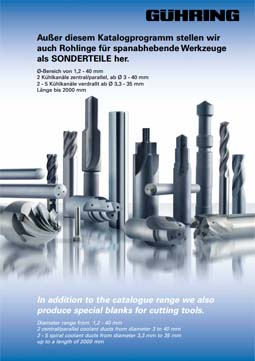
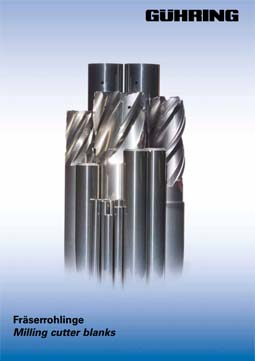

Характеристики режущего инструмента во многом зависят от материала, из которого он изготовлен. Многое зависит от соотношения карбида вольфрама и кобальта, от размера и равномерности зерна.

Наша компания является производителем осевого монолитного инструмента из твердого сплава, что позволяет судить о существующих альтернативах на этом рынке, соответствии цены и качества конкурирующих поставщиков. Основным вектором для нас является высокое качество и его постоянство, срок поставок, гибкость в номенклатуре заказа.

В ходе многочисленных испытаний различных марок, представленных в России, в том числе применяемо к разным группам обрабатываемых материалов и разным способам обработки, мы пришли к выводу, что заготовки из твердого сплава марки GÜHRING (Германия) наиболее полно удовлетворяют даже самые притязательные запросы наших заказчиков. В дальнейшем развитие сотрудничества привело к получению нами статуса официального дилера этой торговой марки.

Мы предлагаем Вам поставку заготовок из твердого сплава Gühring напрямую с нашего склада в городе Пенза.

При производстве наших изделий мы применяем марки DK460UF (универсального применения), DK255F и DK500UF.

  
