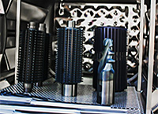
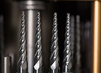
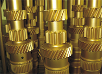
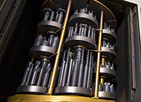

Мы предоставляем услуги по нанесению износостойких и защитных тонкопленочных покрытий с высокой адгезией на установке Platit Pi80.

Примеры изделий, на которые можно нанести наши покрытия:

* твердосплавные сверла, фрезы, развертки;
* метчики и быстрорежущий инструмент;
* зуборезный (долбяки, червячные фрезы);
* резьбонакатные ролики и прокатные валки;
* матрицы, пуансоны и вырубные штампы.

Наш опыт при производстве собственного твердосплавного инструмента и работе с изделиями заказчика показывает, что применение современных износостойких покрытий дает значительный эффект, а в ряде случаев является единственно возможным средством реализации технологического процесса с заданными параметрами по производительности и надежности. На сегодняшний день более 90% твердосплавного инструмента и более 70% быстрорежущего покрывается, а для ряда зуборезного этот показатель доходит до 100%.

При этом предъявляются особые требования к изделиям: они должны быть в чистом виде, без следов смазки, краски, скотча. Изделия должны находиться в упаковке, исключающей возможность повреждения продукции при транспортировке. Изделия должны быть размагничены. Не допускается наличие антикоррозийных, гальванических, защитных покрытий. Во внутренних каналах не допускается наличие остатков окалины и реагентов от термической обработки.

Следует отметить, что изготавливаемый нами инструмент всегда демонстрирует эффективную обработку и большую стойкость. Мы применяем покрытие nACo-G (разработка фирмы Platit).

   

Источник фото – Platit.
